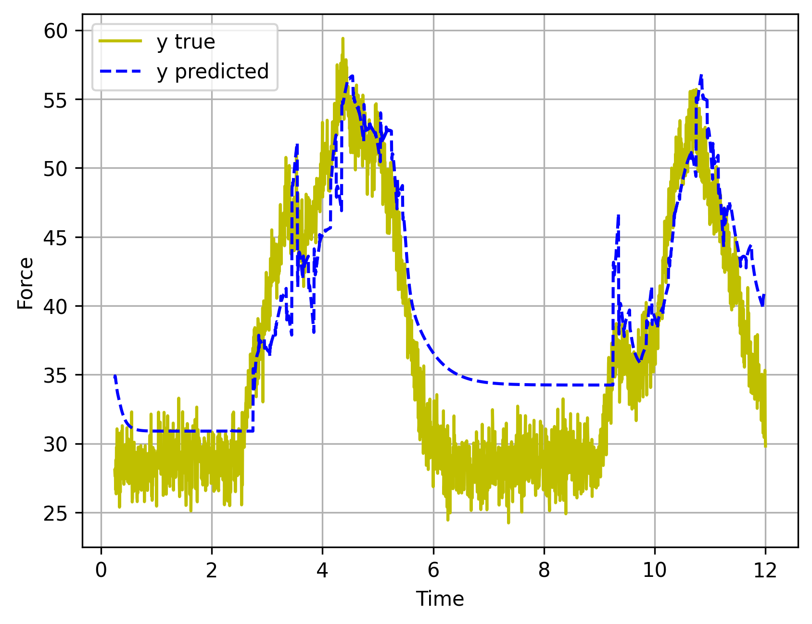

# install
~bash$ 
pip3 install torch --index-url https://download.pytorch.org/whl/cu118 pip3 install numpy==1.26.4 pandas==2.1.3
conda install matplotlib pandas

Hasee wsl 虚拟机：
python>= 3.8
pip3 install torch==2.8.0 torchvision
pip install numpy==1.23.5 pandas==2.3.1
（台式cu121）

# example mlp
```bash
python3 actuator_net_mlp.py --mode train --data train_motor_csv/robot_data_04_11_13_24_Ankle.csv --output train_motor_csv/motor_Ankle.pt
```
<div style="text-align: center;">
  
</div>

# for ymbot-E
```bash
python3 actuator_net_mlp.py --mode train --data train_motor_csv/robot_data_04_11_13_24_Ankle.csv --output train_motor_csv/motor_Ankle.pt
python3 actuator_net_mlp.py --mode train --data train_motor_csv/robot_data_04_11_13_24_HipKnee.csv --output train_motor_csv/motor_HipKnee.pt
python3 actuator_net_mlp.py --mode train --data train_motor_csv/robot_data_04_11_13_24.csv --output train_motor_csv/motor_all.pt

# after training change mode to play
python3 actuator_net_mlp.py --mode play --data train_motor_csv/robot_data_04_11_13_24_Ankle.csv --output train_motor_csv/motor_Ankle.pt
python3 actuator_net_mlp.py --mode play --data train_motor_csv/robot_data_04_11_13_24_HipKnee.csv --output train_motor_csv/motor_HipKnee.pt
python3 actuator_net_mlp.py --mode play --data train_motor_csv/robot_data_04_11_13_24.csv --output train_motor_csv/motor_all.pt
```

# lstm

```bash
python3 test_lstm.py
python3 actuator_rnn.py --data train_turbo_csv/fly_robot_LPV_data.csv --output train_turbo_csv/fly_robot_LPV.pt
```

# v0 SISO-lstm
（自回归），拟合效果差，抖动明显
```bash
python3 actuator_lstm.py --data train_turbo_csv/fly_robot_LPV_data.csv --output train_turbo_csv
```
<div style="text-align: center;">
  
</div>


# v1 滑动窗口（2x lstm + 1x mlp）
```bash
python3 actuator_lstm_v1.py --data train_turbo_csv/fly_robot_LPV_data.csv --output train_turbo_csv
```
<div style="text-align: center;">
  
</div>


# v2 online lstm
主要靠hidden state，减少了推理消耗，训练时使用TBPTT，训练时长较久
loss weight 逐渐变大，更专注于未来推断的准确率
num_time_steps暂定50*0.005s=0.25s，等真机实验后要分析涡喷推力与多少时间前的输入的相关性再确定该值。
```bash
python3 actuator_lstm_v2.py --data train_turbo_csv/fly_robot_LPV_data.csv --output train_turbo_csv
```

<div style="text-align: center;">
  
</div>